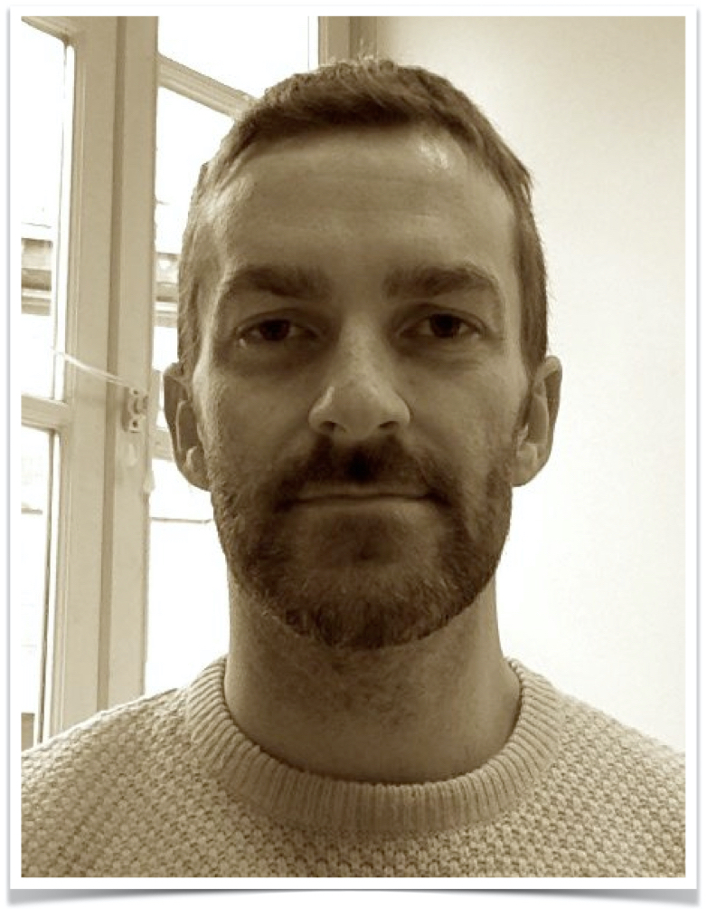
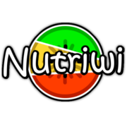

<style>
.forceBreak { -webkit-column-break-after: always; break-after: column; }
</style>

```{r setup, include = FALSE}
knitr::opts_chunk$set(
  collapse = TRUE,
  comment = "#>",
  echo = TRUE
)
source("../inst/extdata/current_link_for_shared_script")
```

## Je me présente {.columns-2}

```{r moi, out.width="75%", echo = FALSE}
# {width=75%}

```

<p class="forceBreak"></p>

 * [Hub de Bioinformatique et de Biostatistiques](https://research.pasteur.fr/fr/team/bioinformatics-and-biostatistics-hub/) 
 * Biostatisticien
 * Intégration de données
 * Programmation en R
 * Analyse de données "omiques"


## Quiz de bienvenue

Allez sur [kahoot.it](https://kahoot.it/) ou utilisez l'application Kahoot !

```{r kahoot, out.width="100%", echo = FALSE}
# {width=100%}
knitr::include_graphics("img/S00programme/Kahoot_Logo.svg")
```


## Au programme {.bigger}

 * Mercredi matin : révisions, représentations graphiques (un peu)
 * Mercredi après-midi : représentations graphiques
 * Jeudi matin : tests statistiques (et représentations graphiques)
 * Jeudi après-midi : fin des tests
 * Vendredi : Analyse de vos propres données


## Au programme... bis {.bigger}

Plutôt le matin

 * Quiz du matin
 * Explications avec exemples
 * Exercices

<p class="forceBreak"></p>

Plutôt l'après-midi

 * Quiz de l'après-midi
 * Explications avec exemples 
 * Exercices
 * Discussion de fin de journée

## Déroulement du cours

Pour favoriser l'interactivité de ce cours, voici ce que je vous propose : 

 * Des quiz (Kahoot, cf. programme)
 * Des exercices réguliers
 * Les étudiant·e·s sont sollicités régulièrement
 * Tutoriels interactifs pour s'entraîner "à la maison"


## Des données simples... pour moi

Composition de produits alimentaires (https://ciqual.anses.fr/)

```{r ciqual, out.width="100%", echo = FALSE}
# {width=100%}
knitr::include_graphics("img/S00programme/ciqual.jpg")
```


## Des données simples... pour moi

Nutriwi (https://www.nutriwi.com/)

```{r nutriwi, out.width="40%", echo = FALSE}
# {width=40%}

```


## Mais aussi...

 * La page du cours : https://vguillemot.github.io/intro2r/
 * Les présentations au format PDF (et parfois HTML)
 * Les exercices et leur(s) solution(s)
 * Des tutoriels interactifs

## Ressources

 * [Document partagé pour écrire du code ensemble](`r currentlink`)
  * Kahoot : [www.kahoot.it](www.kahoot.it)
  * Posit (fka Rstudio) : [https://posit.co](https://posit.co)
  * [Rstudio (desktop)](https://posit.co/download/rstudio-desktop/)
  * Comprehensive R Archive Network : [https://cran.r-project.org/](https://cran.r-project.org/)
  * Bioconductor : [https://www.bioconductor.org/](https://www.bioconductor.org/)
  * L'[aide-mémoire créé par Julien Chiquet](../inst/extdata/CommandesUsuelles.pdf)
  * Les données [fruits](../inst/extdata/fruits.xlsx) et les données de [recettes](../inst/extdata/nutriwi.xlsx) (au format `xlsx`)

****

  * Les [feuilles de triche de Rstudio](https://posit.co/resources/cheatsheets/) (EN) de
    - [dplyr](https://posit.co/wp-content/uploads/2022/10/data-transformation-1.pdf) (EN)
    - [ggplot2](https://posit.co/wp-content/uploads/2022/10/data-visualization-1.pdf) (EN)
  * La page STDHA sur [les couleurs](http://www.sthda.com/french/wiki/couleurs-dans-r) (FR)
  * [R pour les débutants d'Emmanuel Paradis](https://cran.r-project.org/doc/contrib/Paradis-rdebuts_fr.pdf) (FR)
  * L'[aide-mémoire de Julien Chiquet](https://vguillemot.github.io/debuter/inst/extdata/CommandesUsuelles.pdf)
  

## moRe ! {.columns-2 .smaller}

  * Livre *R for Data Science* : https://r4ds.had.co.nz/
  * Livre *R Cookbook* : https://rc2e.com/
  * Livre *Modern Data Science with R* : https://mdsr-book.github.io/mdsr2e/
  * Livre *Computational Genomics with R* : https://compgenomr.github.io/book/
  * Livre *ggplot2: elegant graphics for data analysis* : https://ggplot2-book.org/index.html
  * Site de référence ggplot2 : https://ggplot2.tidyverse.org/reference/
  * Extensions ggplot2 : https://exts.ggplot2.tidyverse.org/gallery/

<p class="forceBreak"></p>


  * *A ggplot2 Tutorial for Beautiful Plotting in R* : https://www.cedricscherer.com/2019/08/05/a-ggplot2-tutorial-for-beautiful-plotting-in-r/
  * Package R patchwork : https://github.com/thomasp85/patchwork
  * Livre *Circular Visualization in R* : https://jokergoo.github.io/circlize_book/book/
  * Livre ComplexHeatmap : https://jokergoo.github.io/ComplexHeatmap-reference/book/
  * Palettes de couleurs : https://github.com/EmilHvitfeldt/r-color-palettes
  
## RNA-Seq {.columns-2 .bigger}

  * Chaine YouTube [StatQuest](https://www.youtube.com/c/joshstarmer/videos)
  * Site DoItYourself Transcriptomics : https://diytranscriptomics.com/
  * Site RNA-Seqlopedia : https://rnaseq.uoregon.edu/

<p class="forceBreak"></p>

  * [*Selecting between-sample RNA-Seq normalization methods from the perspective of their assumptions*](https://academic.oup.com/bib/article/19/5/776/3056951) (Evans 2017) : 
