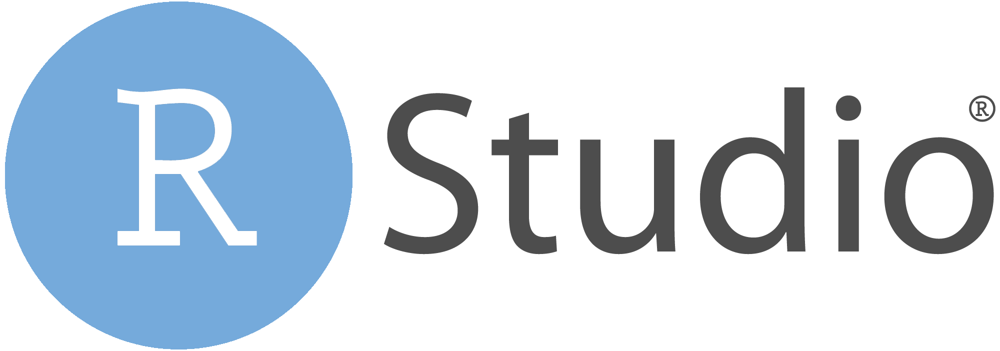

<style>
.forceBreak { -webkit-column-break-after: always; break-after: column; }
</style>

```{r setup, include = FALSE}
knitr::opts_chunk$set(
  collapse = TRUE,
  comment = "#>",
  echo = TRUE
)

source("../inst/extdata/current_link_for_shared_script")
library(ggplot2)
```


## La différence entre R et Rstudio {.columns-2 .smaller}


R est d'abord un **langage de programmation** qui a pour but principal de permettre d'analyser des données et de produire des représentations graphiques.

Mais c'est également un logiciel Open Source, libre et gratuit qui peut s'installer sur tous les systèmes d'exploitation classiques (Mac, Windows et Linux).

De plus la communauté des utilisateurs de R met à disposition 18261 (le 24/09/2021) packages qui permettent d'appliquer toutes les procédures statistiques imagineables, des plus classiques aux plus récentes.

<p class="forceBreak"></p>

Posit (anciennement Rstudio) est une entreprise à but non lucratif (*B Corps™*) qui met à disposition de la communauté, entre autres, des logiciels Open Source, libres et gratuits. Parmi ces logiciels : l'éditeur de programme Rstudio.

Rstudio est disponible sur tous les systèmes d'exploitation classiques (Mac, Windows et Linux).

Rstudio permet de programmer en R dans un environnement fiable, riche et très complet. Son interface graphique a été pensée pour permettre aux utilisateurs débutants de bénéficier de fonctionnalités permettant de les aider à maîtriser le langage, et beaucoup de fonctionnalités avancées pour les utilisateurs aguerris!


## Comprehensive R Archive Network

Le site : https://cran.r-project.org/

```{r rlogo, out.width="25%", echo = FALSE}
# {width=25%}
knitr::include_graphics("img/S01rstudio/Rlogo.svg")
```


 * Installation : https://cran.r-project.org/bin/
 * Packages : https://cran.r-project.org/web/packages/index.html
 * Task Views : https://cran.r-project.org/web/views/

## Sans Rstudio (Mac OS X) {.columns-2}

### Avec un Terminal

Taper R, puis "Entrée"

```{r terminal, out.width="100%", echo = FALSE}
# {width=100%}
knitr::include_graphics("img/S01rstudio/Terminal.png")
```


<p class="forceBreak"></p>

### Avec le "GUI"$^\star$ {.smaller}

Démarrer l'application "R"

```{r rgui, out.width="90%", echo = FALSE}
# {width=90%}
knitr::include_graphics("img/S01rstudio/RGUI.png")
```

> $^\star$GUI = *Graphical User Interface*


## Rstudio

Le site : https://www.posit.co/

```{r rstudio, out.width="25%", echo = FALSE}
# {width=25%}

```

 * Installation : https://posit.co/download/rstudio-desktop/
 * Tutoriels : https://posit.co/resources/videos/
 * Feuilles de triche : https://posit.co/resources/cheatsheets/

## Explorons Rstudio

Après avoir démarré l'application

```{r rstudio3panels, out.width="80%", echo = FALSE}
# {width=80%}
knitr::include_graphics("img/S01rstudio/Rstudio.png")
```

## Les 4 panneaux

Après avoir créé un nouveau script

```{r rstudio4panels, out.width="80%", echo = FALSE}
# {width=80%}

```


## Les 4 panneaux -bis 


```{r 4panneaux bis, echo = FALSE, out.width = "100%", cache = TRUE}
dat <- data.frame(x = rep(1:2, 2), y = rep(2:1, e = 2), P = factor(1:4))
img <- png::readPNG("img/S01rstudio/Rstudio4panneaux.png")
g <- ggplot(dat, aes(x, y, fill = P, label = P)) +
  ggpubr::background_image(img) +
  geom_tile(show.legend = FALSE, alpha = 0.5) + 
  geom_point(aes(color = P), size = 30, shape = 21, fill = "white", 
             show.legend = FALSE) +
  geom_text(aes(color = P), vjust = 0.5, hjust = 0.5, size = 20, 
            show.legend = FALSE) + 
  theme_void()
print(g)
```

## Les 4 panneaux -ter {.columns-2}


```{r 4panneaux ter, echo = FALSE, out.width = "100%", cache = TRUE}
print(g)
```

<p class="forceBreak"></p>

  1. Script
  2. Environnement, historique, tutoriels
  3. Console (le cerveau !)
  4. Plots, packages, (fichiers)

## Créer un projet

Créez un projet au début de chaque cours !

{width=80%}

## Pourquoi créer un projet ?

### Réponse courte 

> "*Parce que ça facilite la vie !*" -Anonyme

### Réponse moins courte : 

 * Pas besoin de (trop) réfléchir au répertoire de travail
 * Un projet Rstudio = un projet d'analyse
 * C'est plus facile à organiser
 * Cela vous force à ranger vos analyses ...
 * Dans des dossiers dont les noms ont du sens !

## Exercice 1


### Créez un projet pour le mercredi matin. Quel est votre répertoire de travail pour ce projet ?

## Exercice 2

### Allez dans le menu "Help" puis sélectionnez "About Rstudio". Quelle est votre version de Rstudio ? Renseignez-la dans [le document partagé](`r currentlink`)

