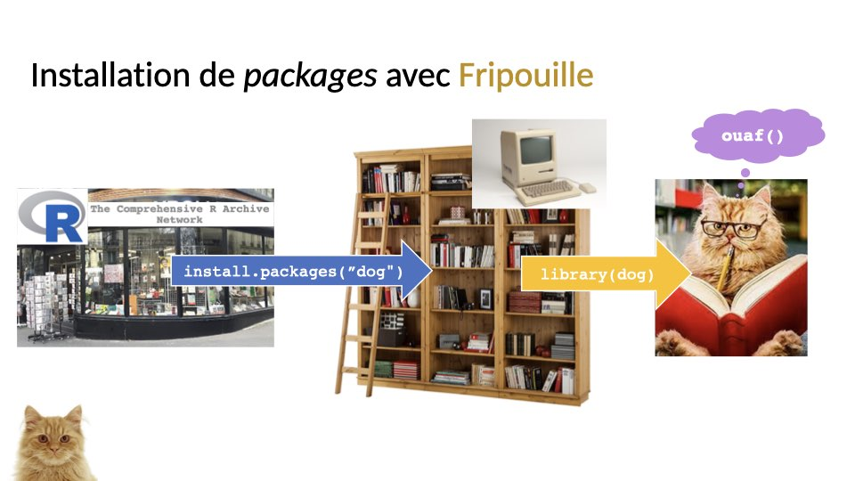

<style>
.forceBreak { -webkit-column-break-after: always; break-after: column; }
</style>


```{r setup, include = FALSE}
knitr::opts_chunk$set(
  collapse = TRUE,
  comment = "#>",
  echo = TRUE
)

## Librairies
library(dplyr)
library(ggplot2)
```


## 

{width=100%}

## 

{width=100%}

## 

{width=100%}

## 

{width=100%}

## 

{width=100%}

## 

{width=100%}

## 

{width=100%}

## 

{width=100%}

## 

{width=100%}

## 

{width=100%}

## Comment installer des packages depuis... {.smaller}


  * Bioconductor ?
    1. Installer le package `BiocManager` depuis le CRAN
    2. Exécuter la commande `BiocManager::install("le_nom_du_package")`
  * GitHub ?
    1. Installer `remotes`
    2. Exécuter la commande `remotes::install_github("username/repository")`.
  * Du code source ?
    1. Mettre le `source.tar.gz` dans son dossier de travail...
    2. ou l'inverse.
    3. Exécuter la commande `install.package("source.tar.gz", repos = NULL, type = "source")`.

# Exercices

## Installez le package du cours

Dans le cadre de ce cours, j'ai créé un package R contenant :

 * les slides (`html` et `pdf`)
 * les données fruits (`csv`, `xlsx`, et `RData`)
 * les données nutriwi (`csv`, `xlsx`, et `RData`)
 * des tutoriels interactifs (`html`)

Installez ce package avec la commande

```{r install, eval = FALSE}
remotes::install_github("vguillemot/intro2r")
```

## Explorez la documentation du package

  1. Chargez le package :  `library(intro2r)`
  2. Regardez l'aide "générale" du package : `?intro2r-package`
  3. Regardez l'aide des données : `?fruits`
  4. Exécutez la commande `bonjour()`
  
# Les tutoriels !

Ils sont disponibles dans un onglet spécial de Rstudio **si vous travaillez avec Rstudio > 1.3**.

## Bonus: la magie de `pak`

 1. Installer `pak`
 2. `pak` a accès au CRAN, à Bioconductor et à GitHub...
 3. Avec une syntaxe facile et des sorties faciles à interpréter !
 4. Mais il faut l'installer d'abord : `install.packages("pak")`
 3. Installation "classique" : `pak::pak("ggplot2")`
 4. Installation "GitHub" : `pak::pak("vguillemot/intro2r")`

```{r pak, echo = FALSE, eval = FALSE}
tibble(x = 1, y = 1, text = "pak") %>%
  ggplot(aes(x, y, label = text)) + 
  geom_text(size = 10) + 
  theme_void()
```

## Résultat

```
> pak::pak("vguillemot/intro2r")
                                                                
→ Will install 1 package.
→ The package (0 B) is cached.
+ intro2r   0.2.1 👷🔧 (GitHub: deff5d4)
ℹ No downloads are needed, 1 pkg is cached
✔ Got intro2r 0.2.1 (source) (42.37 MB)
ℹ Packaging intro2r 0.2.1
✔ Packaged intro2r 0.2.1 (10.9s)                               
ℹ Building intro2r 0.2.1                                       
✔ Built intro2r 0.2.1 (1.7s)                                   
✔ Installed intro2r 0.2.1 (github::vguillemot/intro2r@deff5d4) (32ms)
✔ 1 pkg: added 1, dld 1 (NA B) [19.2s]  
```

